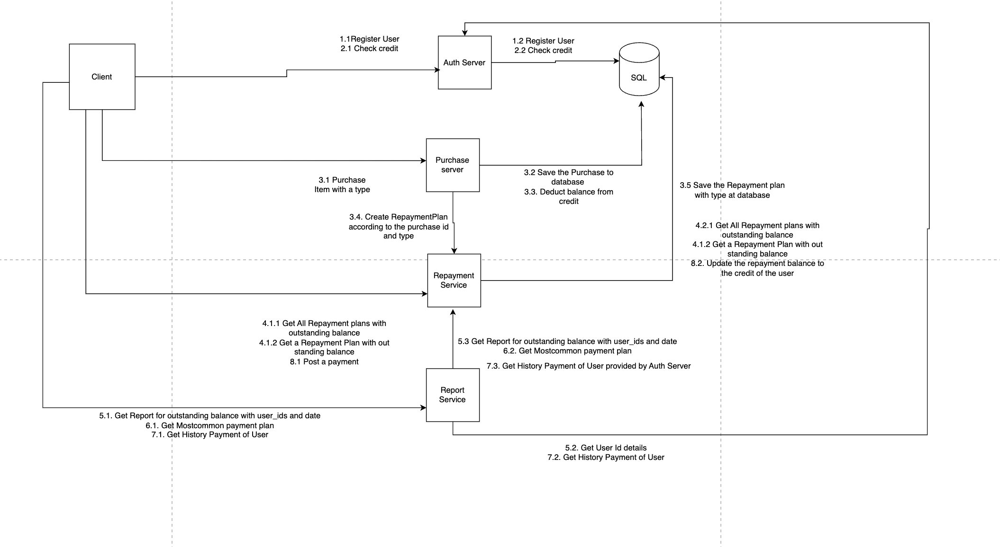

## Table of Contents
- [Buy Now, Pay Later System](#BuyNowPayLaterSystem)
- [Functional Requirements](#functional-requirements) 
- [NonFunctional Requirements](#nonfunctional-requirements)
- [Database Schema](#database-schema)
- [API Endpoints](#api-endpoints)
- [High Level System Design](#high-level-system-design)
- [Low Level System Design](#low-level-system-design)
# Buy Now, Pay Later System

  We want to design a system where users can purchase items on credit and repay the borrowed amount using fixed monthly payments or EMIs. The system should calculate penalties for late payments and interest for EMIs.

## Functional Requirements
  - User Registration & Credit Assignment:
      - Users have a maximum credit limit.
      - Users can check their available credit.
  - Purchases:
      - Users can make purchases if they have sufficient available credit.
      - Deduct purchase amounts from the available credit.
  - Repayment Plans:
      - Users can choose between:
          -  Fixed Payment for a particular purchase.
          -  EMI Plan: Monthly installments with interest over a fixed number of months.
      - Calculate and store the repayment schedule in memory.
      - Add repayment amount to available credit.
  - Penalties for Late Payments:
      - Calculate penalties for overdue payments based on country-specific rates.
  - Reports & Queries:
      - Fetch outstanding balance, repayment schedules, and penalties.

## NonFunctional Requirements
1. Scalability
2. Performance
3. Low Latency

## Database Schema
-  We are using SQL(In Memory Database) as it provide ACID Properties which can use in our app.
-  There are two relational tables which are as follows:
    1. User Table    
       - user_id	VARCHAR	Primary Key
       - name	VARCHAR	User's name
       - email	VARCHAR	User's email
       - credit_limit	DECIMAL(10, 2)	Max credit limit
       - available_credit	DECIMAL(10, 2)	Remaining credit
    2. Purchase Table
        - purchase_id	VARCHAR	Primary Key
        - user_id	VARCHAR	Foreign Key to User Table
        - amount	DECIMAL(10, 2)	Purchase amount
        - purchase_date	TIMESTAMP	Date of purchase
    3. Repayment Plan Table        
         - plan_id	VARCHAR	Primary Key
         - purchase_id	VARCHAR	Foreign Key to Purchase Table
         - type	ENUM	Full Payment / EMI
         - emi_months	INT	Duration of EMI in months
         - interest_rate	DECIMAL(5, 2)	Interest rate
         - emi_amount	DECIMAL(10, 2)	Monthly EMI
         - start_date	TIMESTAMP	EMI start date
         - end_date	TIMESTAMP	EMI end date
    4. Payment Table
         - payment_id	VARCHAR	Primary Key
         - plan_id	VARCHAR	Foreign Key to Repayment Plan
         - payment_date	TIMESTAMP	Date of payment
         - amount_paid	DECIMAL(10, 2)	Amount paid
         - penalty_amount	DECIMAL(10, 2)

## API Endpoints
  - 
    - POST /api/users/register: Registers a user with username and password and basic information.
    - GET /api/users/credit:  Check the available credit
    - POST /api/users/login: Authenticates user based on username and password
    - POST /api/users/logout: Logout the current user
    - GET /api/users/plans: This would get us all the active EMIs and the total outstanding balance.
    - GET /api/users/plans/{emiid}: Get EMI wise outstanding balance as well
    - POST /api/purchase: Purchase item, user can select purchasing type and save to database, update the balance in the credit of the user
        - Request: {
                      "user_id": "U12345",
                        "amount": 20000,
                        "type": "EMI",
                        "emi_months": 6
          }
    - POST /api/purchase/plan: While Purchasing using will create a  repayment plan and it will be save to database
    - POST /payments: User will pay the amount to Repayment Service and it will check penalties for overdue payments based on country-specific rate. Later it will save the repayment amount to credit balance of the user
    - GET /reports?date_range=()& user_ids=()&amount range=(): Get all outstanding payments which can be filtered by date range, user_ids, amount range
    - GET /history/user_id?={user_id}: Get repayment history of a user

## High level system design
-  This is the Flow
  

- For Scalability, we can introduce a load balancer which will transfer the request to various application instances. We can horizontally scale the servers by adding more server.
- For Latency, we can improve database read query optimization, by using read replicas which are used for using optimization.
- For Performance, we can use Redis cache in front of database which will improve the performance 

## Low Level System Design
1. UserService:
  - Methods:
      - User registerUser(String name, String email, BigDecimal creditLimit);
      - BigDecimal getAvailableCredit(String userId);
      - void updateCredit(String userId, BigDecimal amount);
2. PurchaseService
  - Methods:
    - Purchase recordPurchase(String userId, BigDecimal amount, boolean isEMI, int emiMonths);
3. RepaymentService:
  - Methods:
    - RepaymentPlan createRepaymentPlan(String purchaseId, PlanType type, int emiMonths, BigDecimal interestRate);
    - void recordPayment(String planId, BigDecimal amountPaid);
    - BigDecimal calculatePenalty(String planId, LocalDateTime paymentDate);
4. ReportService:
  - Methods:
     - List<RepaymentPlan> getOutstandingPayments(LocalDate startDate, LocalDate endDate, List<String> userIds);
     - String getMostCommonPaymentPlan();
     - List<RepaymentPlan> getRepaymentHistory(
